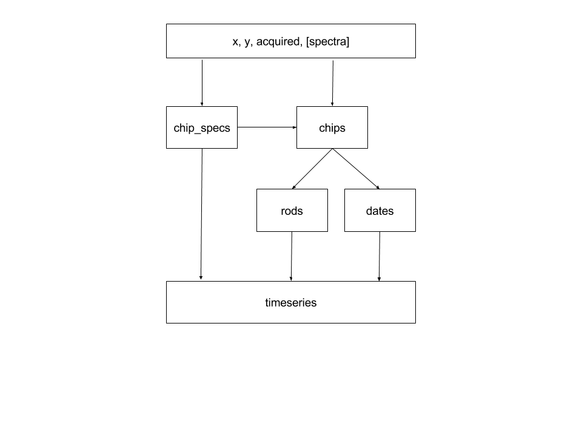

Design
======

   Data Transformations From Source To Timeseries.

Timeseries creation in Merlin is a series of data transformations, beginning
with the values for x, y, acquired (range), and a dictionary of chip spec
queries.  x and y are coordinates in a spatial projection, acquired is
an ISO8601 date range string, and queries are ElasticSearch URL queries.

These values are used to retrieve first a set of chip specs, and then the
stacks of chips.  A chip spec is a dictionary containing shape, data type, and
size information for a chip as well as other metadata.  A chip is a single two
dimensional array of values representing an observation by a particular
satellite, from a particular mission, on a known date and in a known spectrum.

A configurable function is applied against the full results of the chips and
chip specs queries before any further operations take place.  The purpose of
this function is to serve as a filter for the data received from the
source.  This is a logical point for verifying that all data was received
correctly and also for determining which dates should and should not be
included in the final time series stack.

The filtered stack of chips is combined with chip spec information
to split and reorganize the observations into rods, or single pixel height &
width observations stacked together in time.

Locations are calculated for each single pixel observation and then merged into
a data structure under the appropriate key value for each x & y pair.

The originating chip's upper left x & y are merged with the
individual observation's x & y to enable consistent partitioning from source
through downstream functions.

Finally, a properly sorted dates array is associated into the top level
data structure beside the spectral stacks.  The order of the dates array matches
the order of observations.

The final data structure appears as...

.. code-block:: python3

    >>> pyccd_format(*args)
        (((chip_x, chip_y, x1, y1), {"dates": [],  "reds": [],
                                     "greens": [], "blues": [],
                                     "nirs1": [],  "swir1s": [],
                                     "swir2s": [], "thermals": [],
                                     "quality": []}),
         ((chip_x, chip_y, x1, y2), {"dates": [],  "reds": [],
                                     "greens": [], "blues": [],
                                     "nirs1": [],  "swir1s": [],
                                     "swir2s": [], "thermals": [],
                                     "quality": []}))

... assuming that the original chip specs query had separate keys for reds,
greens, blues, etc.
